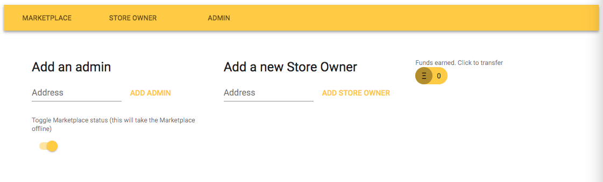
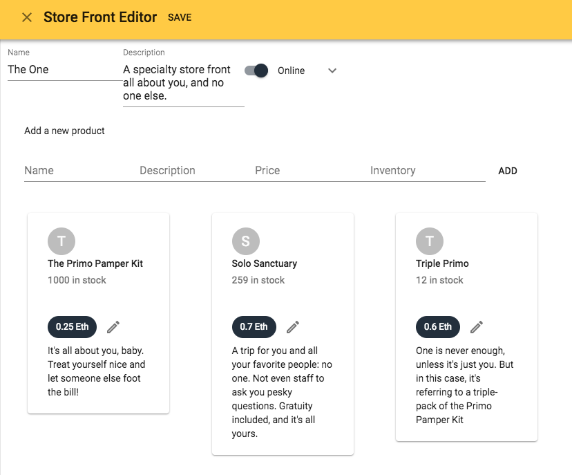
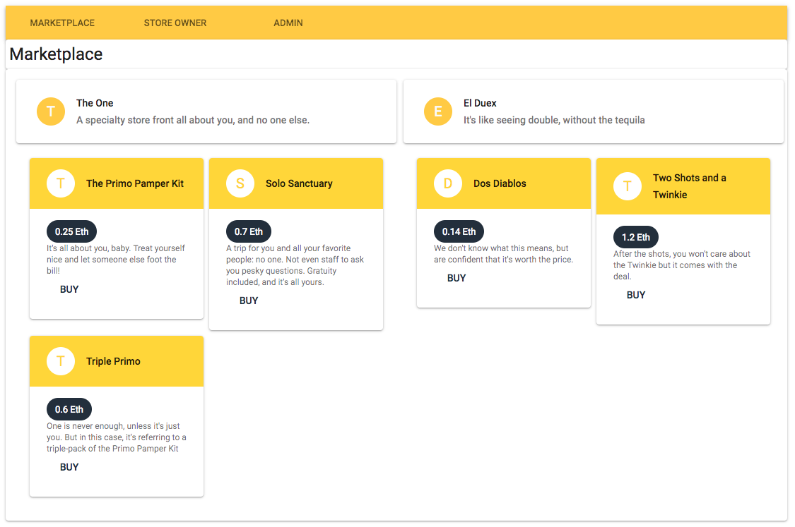

# The Marketplace

Consensys 2018 Final Project submission

Hey! I'm Will Button and _this_ is my 2018 project submission.

* [Overview](#about)
* [Setup](#setup)
* [Navigation](#navigation)
* [Test Descriptions](#running-tests)
* [Design Pattern Decisions](docs/design_pattern_decisions)
* [UI Design](#ui-design)
* [Avoiding Common Attacks](docs/avoiding_common_attacks.md)
* [ToDo](#to-do)
* [Contact Me](#help,-support,-contact)

## About (What does the app do?)

This app is an online marketplace that allows the contract owner to operate an ecommerce portal. Site admins can add new store owners, view funds earned, and transfer funds to their wallet.

Store Owners can setup multiple store fronts and list their products for sale in each store front. Items for sale can have a product name, description, price, and inventory. The store owner can add new store fronts and products, edit existing store fronts and products, and transfer the revenue earned from their sales to their wallet.

Shoppers are defined as anyone using the site who is not an admin or store owner (although admins and store owners can be shoppers as well). Shoppers can use the main shopping portal to see all stores and the products offered. They can purchase products in bulk.

The contract owner receives 10% of the total sales. The amount earned is displayed on the admin page. Any admin can transfer part or all of the funds to their wallet.

## Getting Started

### Requirements

- node.js v8.9.4 or higher (tested to 10.9.0)
- Truffle framework v4.1.13
- Solidity v0.4.24
- git
- Chrome, Brave, or Firefox browser
- Metamask
- ganache-cli

### Setup

- Clone the repo `git@github.com:rekibnikufesin/marketplace.git`

- Got Docker and on Linux or OS X? Type `make run-new-marketplace`

- Or `docker build -t marketplace:local .` followed by `docker run -p 3000:3000 marketplace:local`

- To run without Docker: `make build-run`

- Or see [Step by step](#step-by-step) below.

Step by step:
- Run `npm install` to install node.js dependencies
- Start ganache-cli or your preferred local test blockchain.
  - Note: You may need to change the network settings on line 27 & 28 in `truffle.js` if your settings differ from `localhost:8545`
- Migrate contracts to the blockchain
  - `truffle compile`
  - `truffle migrate`
- Run tests with `truffle test`
- Launch the application with `npm start`
  - Note: This app was created using the [react-create-app](https://github.com/facebook/create-react-app) tool. One of the side effects of this approach is the app requires all imports to be located within the `src/` folder. `truffle migrate` however, copies the deployed contract interface to the `build/contracts` folder, making in inaccessible from React. As a result, I created a customized `npm start` command to copy the latest contracts from the `build/` folder to `src/build`.
  - The application runs on [http://localhost:3000](http://localhost:3000). Any port conflicts here from other local apps will cause issues.
  - TL;DR: migrate contracts before starting node.js 😅
- Your browser will automatically launch.
- Webpack will take a minute or two to transpile & bring the server online the first time

### Navigation

#### Admin

- Head on over to [http://localhost:3000/#/admin](http://localhost:3000/#/admin)

- Add an admin or a store owner by adding the ethereum address in the text field and clicking the appropriate button. You can even add the current user as a Store Owner

- Once your marketplace has earned some funds, they can be transferred using the yellow Ethereum button

- Click the slider to take the marketplace offline. While offline, shoppers are unable to make purchases and Store Owners are unable to edit store fronts and products. They can however, transfer their funds out.

- All transactions will provide a toaster-style pop-up with confirmation details once confirmed on the network

#### Store Owner

- As a Store Owner, head to [http://localhost:3000/#/store](http://localhost:3000/#/store)

- 🐞 Known bug: There's some funkiness adding products. They always save, but the page isn't refreshing consistently. Need to look at when the promises fulfill and dispatch.

- Add a new Store Front by filling out the details and clicking the button

- Once the store front is added, you can add products to it by clicking the pencil icon

- Much like the Ether button on the Admin page, you can click to transfer funds earned to your address

#### Shopping in the Marketplace

- Take a shopping trip at [http://localhost:3000/#/home](http://localhost:3000/#/home)

- Click the `BUY` button

- Enter the quantity desired

- Confirm purchase

- Note how the `BUY` button switches to say `Pending...` until the transaction is confirmed on the network, at which point it switches back to `BUY` and a toaster pop-up displays the transaction id.

### Running Tests
All tests are written in Javascript. I chose this pattern due to limitations of Solidity tests in capturing exceptions. This was a requirement to test not only that expected behavior exists, but also that the expected behavior is denied when prerequisites aren't met. While it's possible in Solidity, it felt much faster, easier, and legible to write them using Javascript.

Tests are broken into the following sections (see `test/testMarketplace.js`)

#### Admin Tests

Tests here cover the following:

- The contract deployer (a.k.a. owner) should be added as the first admin. This is a necessary component as being an admin is a requirement to adding additional admins. To ensure this functionality always exists, I test for its presence in the constructor.

- While not listed as a Solidity common attack, privilege escalation is a common attack vector. To ensure the integrity of the admins remains intact, there is a test to ensure a non-admin can't add an admin.

- Admins are the only personnel allowed to add Store Owners, so it's tested here to ensure that feature doesn't inadvertently get broken. The inverse is also tested- non-admins can't add Store Owners.

- Admins are the only personnel allowed to execute the emergency stop feature. A test ensures it works, and that non-authorized parties are denied access.

#### Store Owner Tests

- Tests exist to ensure Store Owners are identified, and non Store Owners are not identified

- Store Front functionality is tested: creating, editing, and listing to verify Store Owners have the capabilities required to perform their functions in the app. The inverse again is tested to ensure the integrity and security of the Store Owner's Store Fronts.

- Product management has a similar set of tests: add and edits, as well as denying access to anyone other than the owner of the product.

#### Purchasing

- Purchasing is tested to ensure products can be purchased from the Marketplace, and additional tests validate our commitment to the Store Owners by ensuring pricing and inventory management works, and that Ether values are validated prior to completing the purchase transaction.

#### Account Balances

- Making money is what this Marketplace is about. I created tests to ensure Store Owners can claim their funds and Admins can withdraw funds from the amount earned by the Marketplace via a 10% fee collected from all purchases.  An additional test exists here to ensure _only_ admins can withdraw funds from the Marketplace balance.

#### Libraries Implemented

I implemented Open-Zeppelin's Safe Math library to avoid Integer Over/Under run attacks. I could also have implemented the Ownable library as well and saved myself the time creating my own `isOwner` modifier.

### UI Design

#### React

I used React as the front end for the application. React provided a way to implement the different features as components, and has a great state management feature.

#### Redux

Redux was implemented to handle the latent network calls. By implements Redux actions and reducers, I could execute contract calls and forget about them. Later when they resolved, an action would be dispatched, triggering a reducer that updated the component properties, and triggered the component to re-render with the updated data.

### Design patterns not used

I reviewed design patterns around monetary functions. Some common patterns I didn't use included locking state for transactions until completed, implementing time delays before functions could be executed, or holding funds in escrow. Those have valid use cases but I felt like they weren't really needed for a simple shopping app like this.

## To Do 

### Rename Store Owner to Merchant

I never liked the name Store Owner. Now that all the code is written, using the word "Merchant" seems a better fit. It's quite a bit of rework, but I'll be happier with the results.

### Allow Store Owners to transfer partial revenue

I implemented this for admins, but it would be nice if a Store Owner could download part of the funds earned instead of all of it, just as an added option for them.

### Track sales

Providing a merchant with sales information would help them better understand customer buying habits, and help them to become a better merchant (which ultimately helps the marketplace). This seems like a good place to implement some off-chain data storage. There's no need for this to be kept in the blockchain.

### Support for digital products

Currently products can only be bought if a sufficient quantity exists in inventory. Adding a digital product flag would allow selling music, videos, documents, etc. with unlimited purchases.

### Allow for product metadata

Helping customers find products leads to increased sales. Adding product metadata could improve that experience and allow searching, recommended products, and related products. This is another good opportunity to implement some off-chain processing.

### Shopping Cart

Allowing customers to shop and add items to a shopping cart would provide a single checkout process, rather than checking out each item individually. It would also save the customer a small amount of gas by consolidating all purchases to a single transaction.

### DRYYYYYYYY

There are some places where the code is about as dry as a Louisiana swamp in the summer. Specifically in the redux actions. There are plenty of opportunities to refactor duplicated code into functions and reduce the code base by a significant portion, plus make maintaining the code easier in the future.

## Help, support, contact

If you have questions, comments, feedback or just want to connect with another Ethereum developer, I can be reached via any of the following:

- Email: [will@willbutton.co](mailto:will@willbutton.co)
- Twitter: [@wfbutton](https://twitter.com/wfbutton)
- LinkedIn: [willbutton](https://www.linkedin.com/in/willbutton/)
- Keybase: [willbutton](https://keybase.io/_/api/1.0/user/lookup.json?usernames=willbutton)
